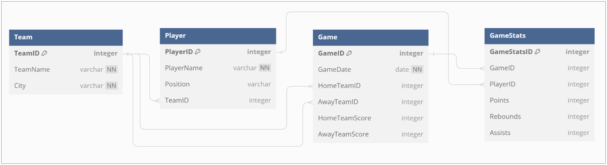

# NBA Game Database – DBMS Project

This project is a relational database system for managing and analyzing NBA game statistics. It was developed as part of a Database Management Systems (DBMS) course project.

## 📌 Features
- Stores data on NBA teams, players, games, and individual game statistics
- Supports complex queries for performance analysis
- Designed with referential integrity and scalability in mind

## Technology Used

- **Database:** Oracle SQL
- **Schema Design:** Entity-Relationship Model (ERM)
- **DDL/DML:** SQL for table creation and data population.

## Entity-Relationship Diagram (ERD)

The ERD below illustrates the entities, their attributes, and the relationships between them.

## 🧱 Database Schema
- **Team**: TeamID, TeamName, City  
- **Player**: PlayerID, PlayerName, Position, TeamID  
- **Game**: GameID, GameDate, HomeTeamID, AwayTeamID, HomeTeamScore, AwayTeamScore  
- **GameStats**: GameStatsID, GameID, PlayerID, Points, Rebounds, Assists  

## 📊 Sample Business Queries
- Top scorer in a specific game
- Average points by team
- Player performance across games

## 📁 Files
- `schema.sql`: DDL for creating tables
- `insert_data.sql`: Sample data population
- `business_queries.sql`: Example analytical SQL queries
- `DBMS_Final_Report.pdf`: Full detailed report
